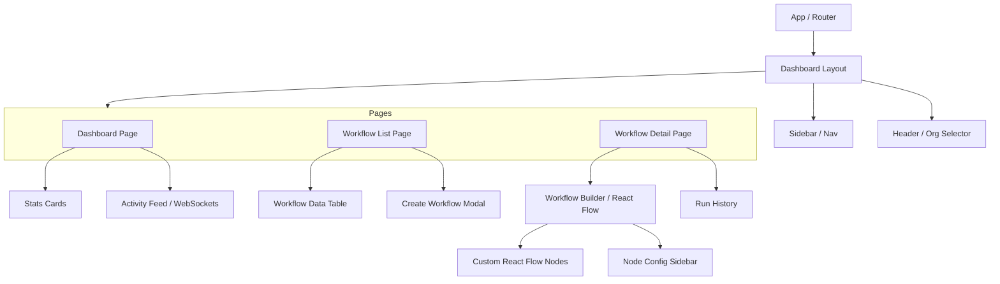

# Flowforge Frontend

This is the frontend application for the Flowforge workflow orchestration engine. Built with Vite, React, TypeScript, Tailwind CSS v4, and React Flow.

## Prerequisites

Before running the application, make sure you have the following installed on your machine:
- **Node.js** (v20 or higher)
- **npm** (v10 or higher)
- *(Optional)* **Docker & Docker Compose** (if you want to run via Docker)

## Development Setup (Without Docker)

If you want to run the frontend locally for development:

1. **Install Dependencies**
   Navigate to the frontend directory and install the required npm packages:
   ```bash
   cd flowforge-frontend
   npm install
   ```

2. **Environment Variables**
   Ensure you have an `.env` file in the root of `flowforge-frontend` (it should already be there). If not, create one:
   ```env
   VITE_API_URL=http://localhost:3000
   VITE_WS_URL=ws://localhost:3000/ws
   ```

3. **Start the Development Server**
   ```bash
   npm run dev
   ```
   The application will be available at [http://localhost:5173](http://localhost:5173).

## Generating API Hooks (Orval)

The frontend uses **Orval** to auto-generate React Query hooks and TypeScript types directly from the backend's OpenAPI (Swagger) specification.

1. Ensure the **backend server is running** (so Orval can fetch the JSON spec).
2. Run the generator:
   ```bash
   npm run generate:api
   ```
   *This will update the `src/api/generated` folder.*

## Running with Docker

If you prefer to run the frontend using Docker, ensure you are in the **flowforge-frontend directory** and run:

```bash
docker-compose up -d --build
```

The frontend will then be accessible at [http://localhost:8080](http://localhost:8080).

## Architecture Overview

- **Feature-Based Structure**: Code is organized by feature (e.g., `features/workflows`, `features/auth`) rather than by type (e.g., all hooks together). This makes the codebase highly scalable and modular.
- **React Flow**: Used for rendering the interactive visual workflow DAG (Directed Acyclic Graph). It handles node positioning, edge routing, and drag-and-drop interactions.
- **TanStack Query (React Query)**: Manages all server state, data fetching, caching, and optimistic UI updates. Hooks are auto-generated via Orval from the backend OpenAPI spec.
- **Socket.io Client**: Maintains a persistent WebSocket connection to the backend for real-time workflow status updates and live streaming of execution logs.
- **Tailwind CSS v4 & Shadcn UI**: Used for rapidly building an accessible, highly customizable, and responsive user interface.

## Component Hierarchy Diagram


